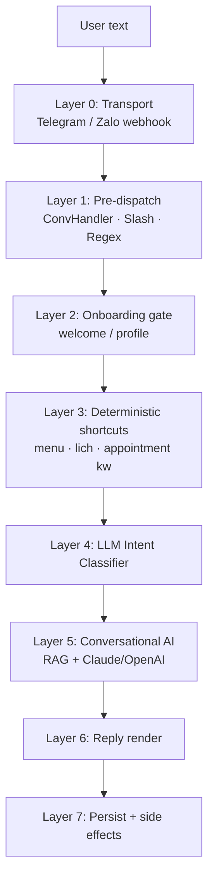
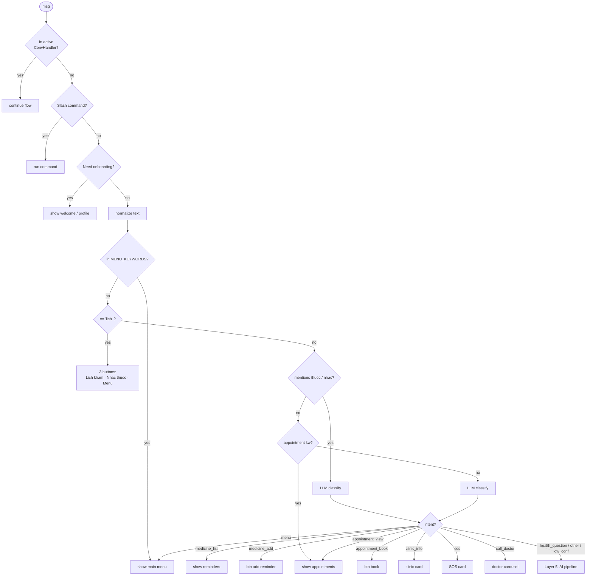
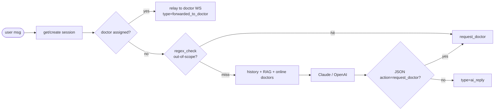
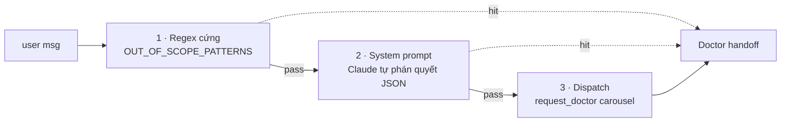

# MedBot — Luồng xử lý tin nhắn người dùng

## Tổng quan các lớp



## Thuật toán quyết định



## Layer 5 — Conversational AI pipeline



## 3 lớp phòng thủ out-of-scope



## Pseudocode

```python
def handle_user_text(text, ctx):
    if in_conversation_flow(ctx):  return route_to_flow()
    if is_command(text):           return route_command()
    if onboarding_required(ctx):   return show_onboarding()

    t = normalize(text)
    if t in MENU_KEYWORDS:         return show_menu()
    if t in LICH_DISAMBIG:         return ask_lich_type()

    if mentions_medicine(t):
        if intent := classify(text):     # LLM, bypass keyword bias
            return dispatch(intent)
    else:
        if appointment_keyword(t):       return show_appointments()
        if intent := classify(text):     return dispatch(intent)

    # Health Q&A fallback (Layer 5)
    if regex_out_of_scope(text):         return request_doctor()
    ctx_text = rag_search(text) + online_doctors_if_relevant(text)
    reply = llm_chat(history + [text], system + ctx_text)
    if json := parse_request_doctor(reply):
        return request_doctor(json)
    return ai_reply(reply)
```

## Bảng nhãn intent (Layer 4)

| Intent | Hành động |
|---|---|
| menu | show_welcome |
| appointment_view / appointment_cancel | _handle_appointment_query |
| appointment_book | btn bk:start |
| medicine_list | show_reminders |
| medicine_add | btn med:new |
| clinic_info | _show_clinic_info |
| sos | _show_sos |
| call_doctor | show_out_of_scope_cta |
| health_question / other | fall through → Layer 5 |

## Đặc điểm thiết kế

- Keyword chỉ làm shortcut rẻ và chắc chắn; mọi câu mơ hồ → LLM classifier.
- Tin nhắn chứa `thuốc/nhắc` luôn đi qua classifier để tránh nhầm câu hỏi y tế thành lệnh nhắc thuốc.
- Classifier tách biệt: prompt riêng, `max_tokens=60`, `temperature=0`.
- Doctor takeover tuyệt đối: bot im lặng khi session đã gán bác sĩ.
- 3 lớp phòng thủ out-of-scope: regex → system prompt JSON → dispatch.
